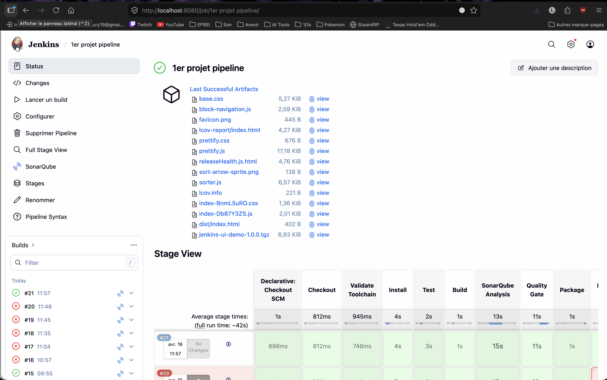
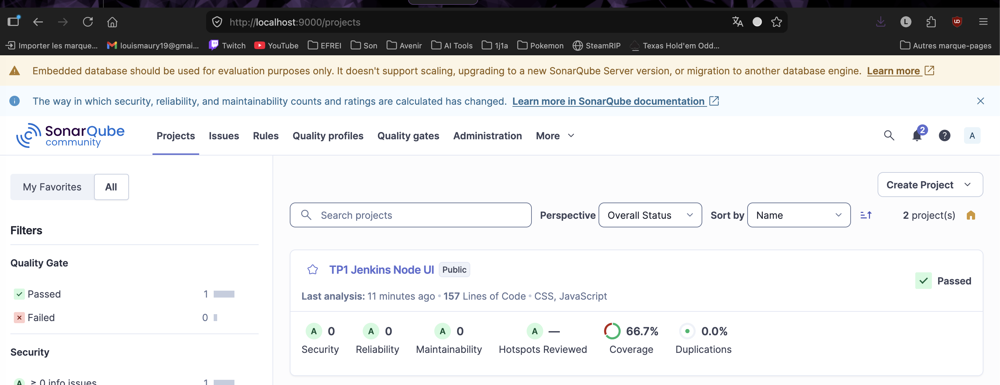
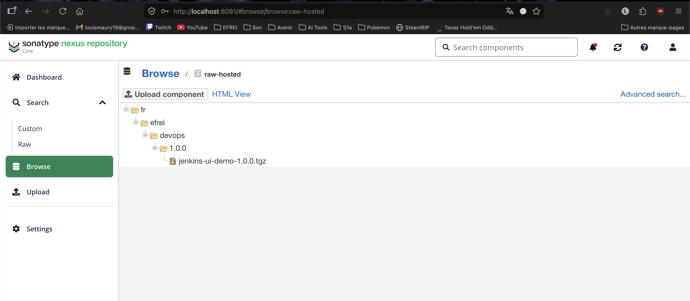

# TP1 - Jenkins / SonarQube / Nexus

## 1. Presentation

Ce projet est une petite application Node.js / Vite utilisee pour mettre en place une chaine CI sur Jenkins.

Objectifs du TP :
- recuperer le code depuis GitHub
- installer les dependances
- executer les tests avec couverture
- construire l application
- lancer une analyse SonarQube
- verifier la Quality Gate
- generer un package `.tgz`
- publier l artefact dans Nexus

## 2. Stack technique

- `Node.js`
- `Vite`
- `Vitest`
- `Jenkins`
- `SonarQube`
- `Nexus Repository`

## 3. Structure du projet

- `src/` : code source de l application
- `src/utils/releaseHealth.js` : logique metier testee
- `src/utils/releaseHealth.test.js` : tests unitaires
- `Jenkinsfile` : pipeline Jenkins declaratif
- `sonar-project.properties` : configuration SonarQube
- `scripts/wait-for-quality-gate.mjs` : attente manuelle de la Quality Gate via l API SonarQube

## 4. Lancement en local

Prerequis :
- `Node.js 20.19+`, `22.12+` ou `24+`

Installation et execution :

```bash
npm ci
npm run dev
```

Application disponible sur :
- `http://localhost:5173`

Commandes utiles :

```bash
npm run test
npm run test:ci
npm run build
npm pack
```

## 5. Tests et couverture

Les tests sont lances avec `Vitest`.

Commande utilisee en CI :

```bash
npm run test:ci
```

Cette commande produit :
- l execution des tests
- un rapport de couverture texte
- un fichier `coverage/lcov.info` exploite par SonarQube

Configuration correspondante :
- [vite.config.js](/Users/louis.maury/Documents/EFREI/M1%20-%20EFREI/DevOps/premierProjetFreestyleJenkins/vite.config.js:1)
- [sonar-project.properties](/Users/louis.maury/Documents/EFREI/M1%20-%20EFREI/DevOps/premierProjetFreestyleJenkins/sonar-project.properties:1)

## 6. Pipeline Jenkins

Le pipeline est defini dans [Jenkinsfile](/Users/louis.maury/Documents/EFREI/M1%20-%20EFREI/DevOps/premierProjetFreestyleJenkins/Jenkinsfile:1).

Ordre des etapes :
1. `Checkout`
2. `Validate Toolchain`
3. `Install`
4. `Test`
5. `Build`
6. `SonarQube Analysis`
7. `Quality Gate`
8. `Package`
9. `Publish Nexus`

### Particularites du pipeline

- verification explicite de la presence de `node` et `npm`
- compatibilite avec `Node.js 20.19+`, `22.12+` et `24+`
- fallback sur `sonar-scanner` installe localement si l outil Jenkins n est pas disponible
- remplacement de `waitForQualityGate` par un script Node.js
  ce choix permet d attendre la Quality Gate sans dependre d un webhook SonarQube
- publication dans Nexus via `curl`
  ce choix evite de dependre du plugin Jenkins `Nexus Artifact Uploader`

## 7. Configuration Jenkins

Configuration utilisee :
- plugin `Git`
- plugin `Pipeline`
- plugin `SonarQube Scanner`
- Node.js installe sur la machine Jenkins
- `sonar-scanner` accessible sur la machine Jenkins

Variables importantes du pipeline :
- `SONAR_INSTANCE = sonarqube-local`
- `NEXUS_URL = localhost:8081`
- `NEXUS_REPOSITORY = raw-hosted`
- `NEXUS_CREDENTIALS = nexus-credentials`
- `APP_GROUP = fr.efrei.devops`

Credentials Jenkins attendus :
- `SONAR_TOKEN` ou token associe a la configuration SonarQube Jenkins
- `nexus-credentials` de type `Username with password`

## 8. Configuration SonarQube

Configuration du projet :
- `sonar.projectKey=tp1-jenkins-node-ui`
- `sonar.sources=src`
- `sonar.tests=src`
- `sonar.test.inclusions=src/**/*.test.js`
- `sonar.javascript.lcov.reportPaths=coverage/lcov.info`

Le pipeline :
- execute bien l analyse SonarQube
- attend la fin de la tache Compute Engine
- recupere le resultat de la Quality Gate via l API SonarQube

## 9. Configuration Nexus

Installation locale realisee avec Homebrew.

Depot configure :
- type : `raw (hosted)`
- nom : `raw-hosted`

Le pipeline genere un package :
- `jenkins-ui-demo-1.0.0.tgz`

Puis tente de l envoyer vers :

```text
http://localhost:8081/repository/raw-hosted/fr/efrei/devops/1.0.0/jenkins-ui-demo-1.0.0.tgz
```

## 10. Etat d avancement

Etat actuellement valide :
- checkout GitHub OK
- installation npm OK
- tests OK
- build Vite OK
- couverture OK
- analyse SonarQube OK
- Quality Gate OK
- creation du package `.tgz` OK

Point restant a finaliser :
- authentification Jenkins vers Nexus
- la requete de publication retourne encore `401 Unauthorized`
- le pipeline est donc fonctionnel jusqu a l etape `Publish Nexus`, mais la configuration du credential Nexus doit encore etre corrigee

## 11. Difficultes rencontrees

Principaux problemes rencontres pendant le TP :
- Jenkins ne dependait pas d une installation Node.js standard au depart
- `waitForQualityGate` posait probleme sans webhook SonarQube
- le step `nexusArtifactUploader` n etait pas disponible dans Jenkins
- il a fallu remplacer certaines integrations plugin par des alternatives plus robustes

Solutions mises en place :
- ajout d une etape `Validate Toolchain`
- utilisation de `scripts/wait-for-quality-gate.mjs` pour interroger l API SonarQube
- utilisation de `curl` pour la publication dans Nexus

## 12. Captures d ecran

### Jenkins
.

### SonarQube
.

### Nexus
.

## 13. Conclusion

Ce projet permet de montrer la mise en place d une chaine CI complete autour d une application Node.js simple.

Les parties suivantes sont fonctionnelles :
- tests
- build
- couverture
- analyse SonarQube
- validation de la Quality Gate
- packaging

La derniere etape a finaliser est la publication authentifiee dans Nexus via Jenkins.
